<div style="text-align: center;"></div>
<div style="text-align: center;"></div>
<div style="text-align: center;"><h3>Showcase your skills on your GitHub or resumé with ease!</h3></div>
<div style="text-align: center;"><h3>Powered by Cloudflare Workers ⚡</h3></div>
<hr>

> NOTE: To keep icons consistent and to ensure browser support, we don't accept pull requests for icon submissions. If
> you would like an icon added, please open an issue.

# Docs

- [Example](#example)
- [Specifying Icons](#specifying-icons)
- [Themed Icons](#themed-icons)
- [Icons Per Line](#icons-per-line)
- [Centering Icons](#centering-icons)
- [Icons List](#icons-list)

# Example

<div style="text-align: center;"></div>
<div style="text-align: center;"></div>

# Specifying Icons

Copy and paste the code block below into your readme to add the skills icon element!

Change the `?i=js,html,css` to a list of your skills separated by ","s! You can find a full list of
icons [here](#icons-list).

```md
[](https://skillicons.dev)
```

[](https://skillicons.dev)

# Themed Icons

Some icons have a dark and light themed background. You can specify which theme you want as a url parameter.

This is optional. The default theme is dark.

Change the `&theme=light` to either `dark` or `light`. The theme is the background color, so light theme has a white
icon background, and dark has a black-ish.

**Light Theme Example:**

```md
[](https://skillicons.dev)
```

[](https://skillicons.dev)

# Icons Per Line

You can specify how many icons you would like per line! It's an optional argument, and the default is 15.

Change the `&perline=3` to any number between 1 and 50.

```md
[](https://skillicons.dev)
```

[](https://skillicons.dev)

# Centering Icons

Want to center the icons in your readme? The SVGs are automatically resized, so you can do it the same way you'd
normally center an image.

```html
<div style="text-align: center;">
  <a href="https://skillicons.dev">
    
  </a>
</div>
```

<div style="text-align: center;">
  <a href="https://skillicons.dev">
    
  </a>
</div>

# Icons List

Here's a list of all the icons currently supported. Feel free to open an issue to suggest icons to add!

| Name              |                                          Icon                                           | Name          |                                        Icon                                         | Name               |                                          Icon                                           |
| :---------------- | :-------------------------------------------------------------------------------------: | :------------ | :---------------------------------------------------------------------------------: | :----------------- | :-------------------------------------------------------------------------------------: |
| `ableton`         |       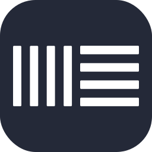       | `gmail`       |              | `python`           |        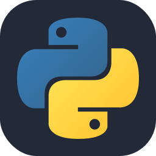        |
| `activitypub`     |   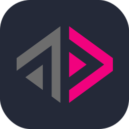   | `godot`       |       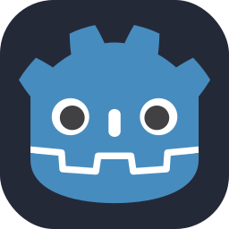       | `pytorch`          |       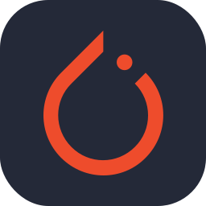       |
| `actix`           |         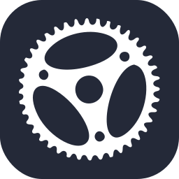         | `golang`      |                      | `qt`               |                        |
| `adonis`          |                          | `gradle`      |            | `r`                |                          |
| `aftereffects`    |       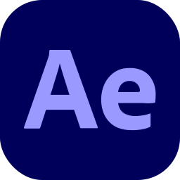       | `grafana`     |          | `rabbitmq`         |      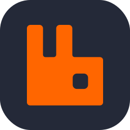      |
| `aiscript`        |            | `graphql`     |     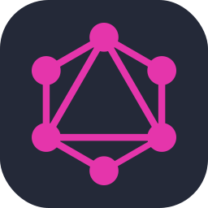     | `rails`            |              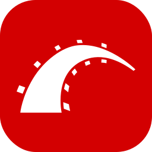              |
| `alpinejs`        |      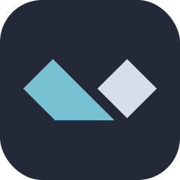      | `gtk`         |         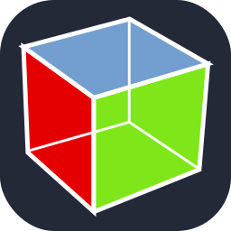         | `raspberrypi`      |   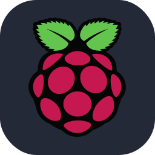   |
| `anaconda`        |            | `gulp`        |                          | `react`            |                  |
| `androidstudio`   |  | `haskell`     |     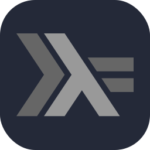     | `reactivex`        |     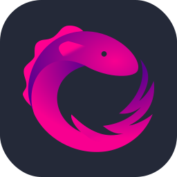     |
| `angular`         |       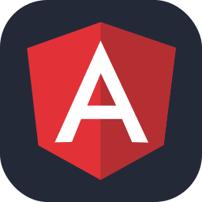       | `haxe`        |        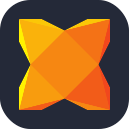        | `redhat`           |                |
| `ansible`         |            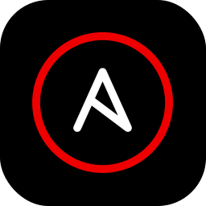            | `haxeflixel`  |  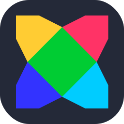  | `redis`            |         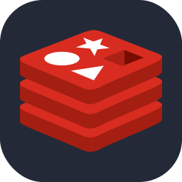         |
| `apollo`          |             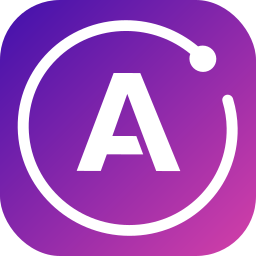             | `heroku`      |                      | `redux`            |              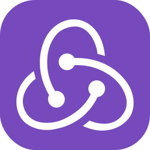              |
| `apple`           |         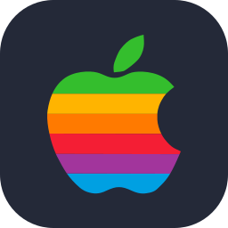         | `hibernate`   |      | `regex`            |         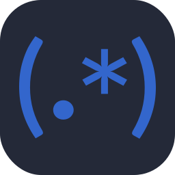         |
| `appwrite`        |           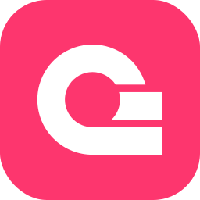           | `html`        |                          | `remix`            |                  |
| `arch`            |          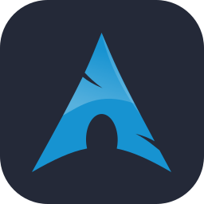          | `htmx`        |        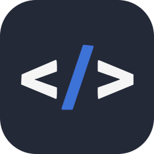        | `replit`           |                |
| `arduino`         |            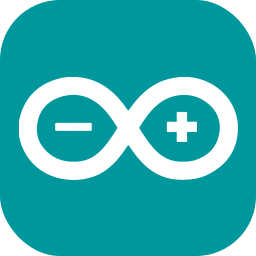            | `idea`        |                | `rider`            |         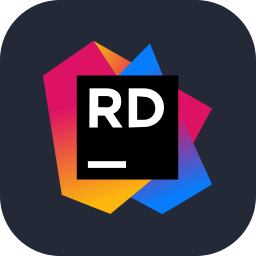         |
| `astro`           |              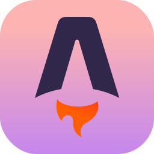              | `illustrator` |      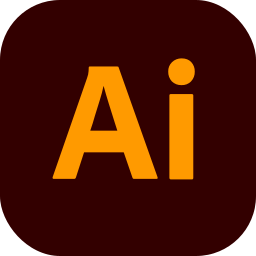      | `robloxstudio`     |       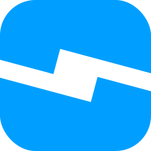       |
| `atom`            |               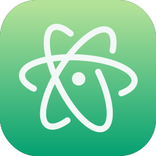               | `instagram`   |                | `rocket`           |                          |
| `audition`        |                      | `ipfs`        |        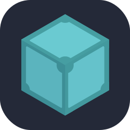        | `rollupjs`         |            |
| `autocad`         |       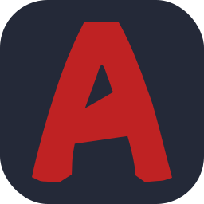       | `java`        |        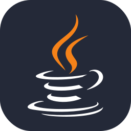        | `ros`              |           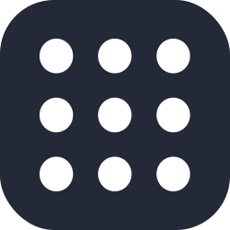           |
| `aws`             |                      | `javascript`  |              | `ruby`             |               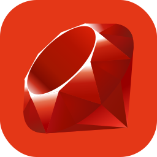               |
| `azul`            |                              | `jenkins`     |          | `rust`             |               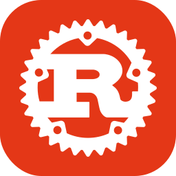               |
| `azure`           |         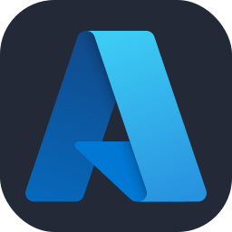         | `jest`        |                          | `sass`             |                              |
| `babel`           |              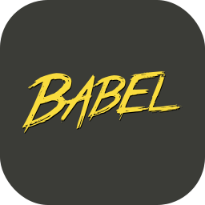              | `jquery`      |                      | `scala`            |         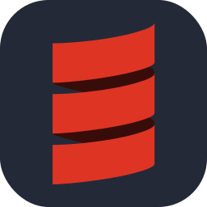         |
| `bash`            |          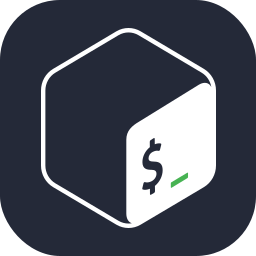          | `julia`       |       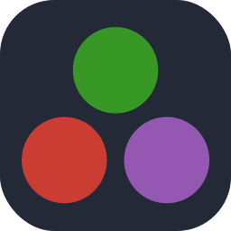       | `scikitlearn`      |   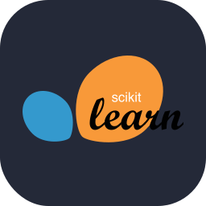   |
| `bevy`            |          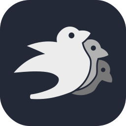          | `kafka`       |            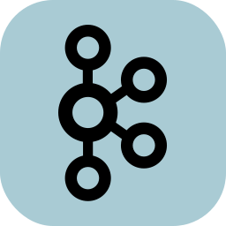            | `selenium`         |                      |
| `bitbucket`       |     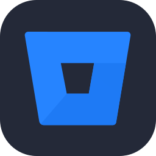     | `kali`        |        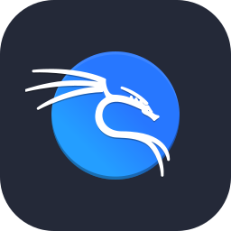        | `sentry`           |                          |
| `blender`         |              | `kotlin`      |      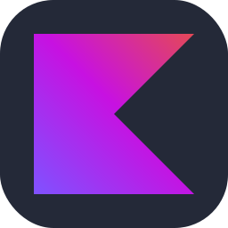      | `sequelize`        |          |
| `bootstrap`       |                    | `ktor`        |                | `sketchup`         |            |
| `bsd`             |                      | `kubernetes`  |              | `solidity`         |                      |
| `bun`             |                      | `laravel`     |          | `solidjs`          |              |
| `c`               |                                    | `latex`       |              | `spotify`          |              |
| `cassandra`       |          | `less`        |                | `spring`           |                |
| `clion`           |                  | `linkedin`    |                  | `sql-server`       |        |
| `clojure`         |              | `linux`       |              | `sqlite`           |                          |
| `cloudflare`      |        | `lit`         |                  | `stackoverflow`    |  |
| `cmake`           |                  | `lua`         |                  | `styledcomponents` |      |
| `codepen`         |              | `markdown`    |        | `sublime`          |              |
| `coffeescript`    |    | `mastodon`    |        | `supabase`         |            |
| `cpp`             |                                | `materialui`  |    | `svelte`           |                          |
| `crystal`         |              | `matlab`      |            | `svg`              |                      |
| `cs`              |                                  | `maven`       |              | `swift`            |                            |
| `css`             |                                | `mint`        |                | `symfony`          |              |
| `cypress`         |              | `misskey`     |          | `tailwindcss`      |      |
| `d3`              |                        | `mongodb`     |                    | `tanstack`         |            |
| `dart`            |                    | `mysql`       |              | `tauri`            |                  |
| `debian`          |                | `neovim`      |            | `tensorflow`       |        |
| `deno`            |                    | `nestjs`      |            | `terraform`        |          |
| `devto`           |                  | `netlify`     |          | `threejs`          |              |
| `discord`         |                        | `nextjs`      |            | `twitter`          |                        |
| `discordbots`     |                | `nginx`       |                        | `typescript`       |                  |
| `discordjs`       |          | `nim`         |                  | `ubuntu`           |                |
| `django`          |                          | `nix`         |                  | `uml`              |                      |
| `docker`          |                          | `nodejs`      |            | `unity`            |                  |
| `dotnet`          |                          | `notion`      |            | `unrealengine`     |              |
| `drizzle`         |                        | `npm`         |                  | `v`                |                          |
| `dynamodb`        |            | `nuxtjs`      |            | `vala`             |                              |
| `eclipse`         |              | `obsidian`    |        | `vercel`           |                |
| `elasticsearch`   |  | `ocaml`       |                        | `verilog`          |                        |
| `electron`        |                      | `octave`      |            | `vim`              |                      |
| `elixir`          |                | `opencv`      |            | `visualstudio`     |    |
| `elysia`          |                | `openshift`   |                | `vite`             |                    |
| `emacs`           |                            | `openstack`   |      | `vitest`           |                |
| `ember`           |                            | `p5js`        |                          | `vscode`           |                |
| `emotion`         |              | `perl`        |                          | `vscodium`         |            |
| `expressjs`       |          | `photoshop`   |                | `vuejs`            |                  |
| `fastapi`         |                        | `php`         |                  | `vuetify`          |              |
| `fediverse`       |          | `phpstorm`    |        | `webassembly`      |                |
| `figma`           |                  | `pinia`       |              | `webflow`          |                        |
| `firebase`        |            | `pkl`         |                  | `webpack`          |              |
| `flask`           |                  | `plan9`       |              | `webstorm`         |            |
| `flutter`         |              | `planetscale` |  | `windicss`         |            |
| `forth`           |                            | `pnpm`        |                | `windows`          |              |
| `fortran`         |                        | `postgresql`  |    | `wordpress`        |                    |
| `gamemakerstudio` |        | `postman`     |                    | `workers`          |              |
| `gatsby`          |                          | `powershell`  |    | `xcode`            |                  |
| `gcp`             |                      | `premiere`    |                  | `xd`               |                                  |
| `gherkin`         |              | `prisma`      |                      | `yarn`             |                    |
| `git`             |                                | `processing`  |    | `yew`              |                      |
| `github`          |                | `prometheus`  |              | `zig`              |                      |
| `githubactions`   |  | `pug`         |                  |                    |                                                                                         |
| `gitlab`          |                | `pycharm`     |          |                    |                                                                                         |
